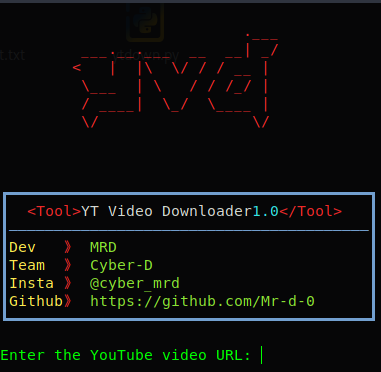

# youtube video downloader

This is a simple tool for downloading YouTube videos that was developed by 'mrd' of Team Cyber-D.

## How To Install
* `sudo apt update`
* `sudo apt upgrade` 
* `sudo apt install python3 git`
* `git clone https://github.com/Mr-d-0/yt-down.git`
* `cd yt-down`
* `pip3 install -r requirement.txt`
* `python3 ytdown.py`
## social medias 
gmail : 09mrd2000@gmail.com      
insta : @cyber_mrd
# Warning  
We are not responsible for any harm or damage caused by this tool.This tool is made for educational purpose.Use it at your own risk!
